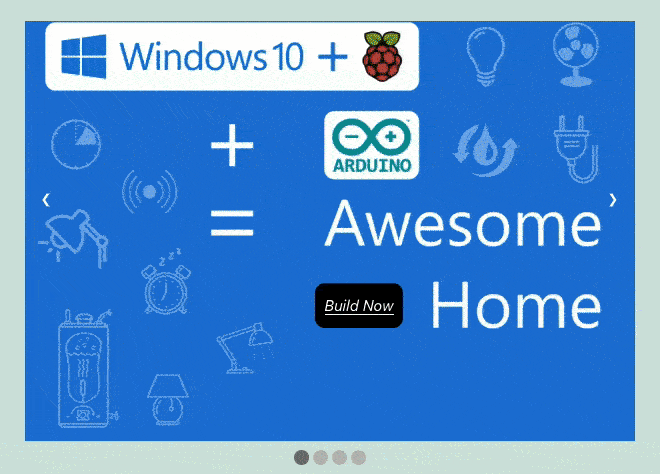
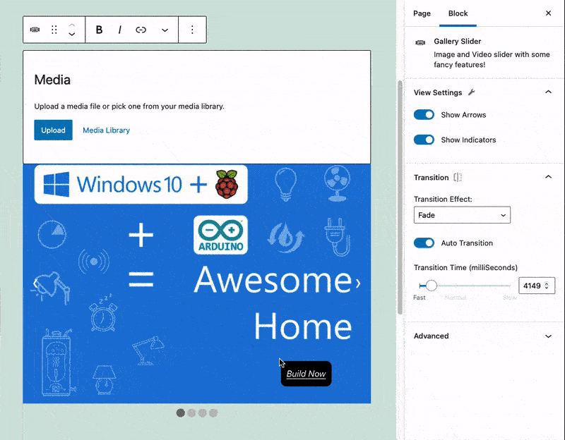

# Gutenberg Gallery Slider

Showcase images and video as gallery slider with some fancy features like Auto-Play/Pause video, show/hide navigation arrows & indicator and custom transition time.

## Features

- Auto Transition
- Transition Time (2.5 seconds to 15.0 seconds)
- Show or Hide Navigation Arrows, Indicator Dots
- Video Auto Play-Pause on Hover
- Draggable CTA

## Installation

1. Upload the plugin files to the `/wp-content/plugins/gallery-slider` directory, or install the plugin through the WordPress plugins screen directly.
2. Activate the plugin through the 'Plugins' screen in WordPress

## Project Information

| Name          | Gutenberg Gallery Slider                  |
| :------------ | :---------------------------------------- |
| Contributors  | Anurag Vasanwala, rtCamp                  |
| Tags          | block                                     |
| Tested up to  | 5.7.0                                     |
| Stable tag    | 0.1.5                                     |
| License       | GPL-2.0-or-later                          |
| License URI   | https://www.gnu.org/licenses/gpl-2.0.html |